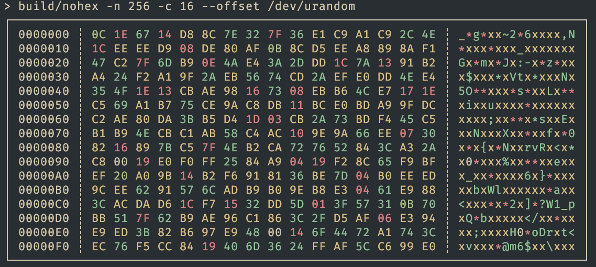

# Nohex

A simple hexdump utility.



## Installation

Requirements: a C99+ compiler and GNU Make.

```bash
git clone https://github.com/ntrupin/nohex.git
cd nohex
make
```

`make` builds an executable at `build/nohex`. For the man pages, run `man docs/hex.1` or read `docs/hex.1.md`.
